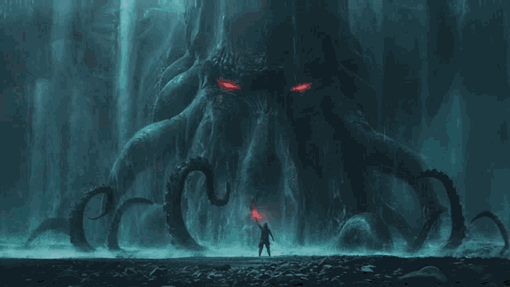

  

  <em>"In the midst of the oceans, there are a lot of unknowns, and thus I will remain in my slumber till my calling."</em>

<h1 align="center"> 
  
</h1>

## 💫 
**About Me**

  🚀 Actively coding new websites and experimenting with all kinds of <strong>microcontrollers</strong>!

## 🌐 
**Socials**

  
  
  
  
  
  

## 💻 
**Tech Stack**

  
  
  

## 📊 
**GitHub Stats**

  
    
  

## 🏆 
**GitHub Trophies**

  

## 🔝 
**Top Contributed Repos**

  

## ✍️ 
**Random Dev Quote**

  

## 🔥 
**Profile Views**

  

---

  <em><strong>Proudly created with</strong> <a href="https://gprm.itsvg.in" target="_blank">GPRM 🚀</a></em>

